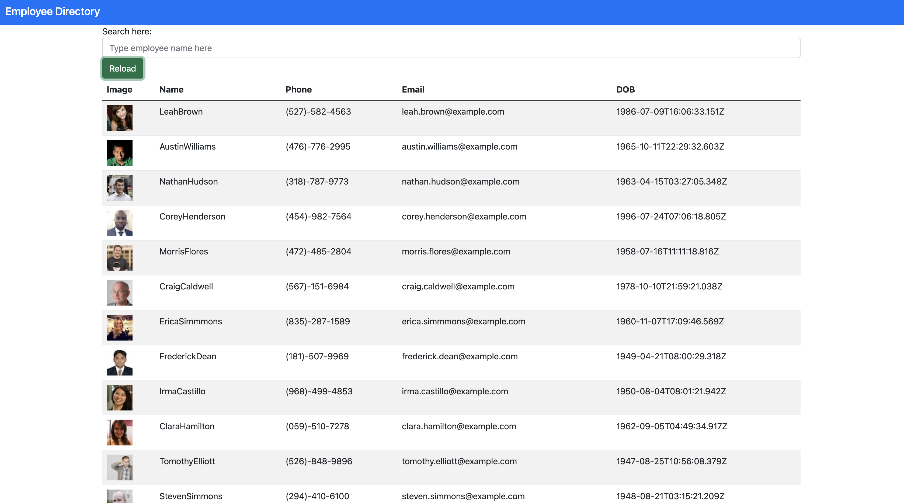

# employee-directory

## Description

This app allows the user to view the entire employee directory at once to have quick access to employee information. The user is also able to filter the directory by the employee's name.

## Table of contents

- [Description](#description)
- [ScreenShot](#screenshot)
- [Deployment](#deployment)
- [Installation](#installation)
- [Usage](#usage)
- [License](#license)
- [Questions](#questions)

## ScreenShot

## Deployment

https://keonak.github.io/employee-directory/

## Installation

To install necessary dependencies, run the following command:

npm install or npm i after you have cloned the repository

## Usage

npm start

## License

This project is licensed under the MIT license.

## Questions

If you have any questions about the repo, open an issue or contact me directly at keonakirby@gmail.com. You can find more of my work at https://github.com/Keonak
